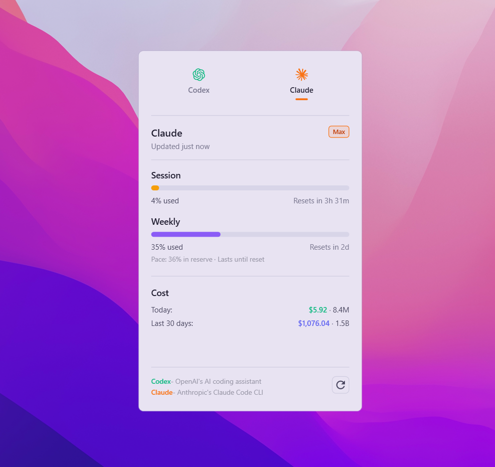

# AI Usage Tray 

A lightweight Windows tray app that shows, behind **one icon**, the live quota of several AI coding subscriptions:

- **Claude** subscription (5-hour and weekly windows) via an isolated OAuth profile
- **Two independent OpenAI / ChatGPT Codex accounts**, each with its own `CODEX_HOME`
- **Z.AI / GLM** coding plan (optional, API key)
- **GitHub Copilot** (optional, experimental, personal access token)

> **This is a fork of [fmdz387/costats](https://github.com/fmdz387/costats)** (MIT).
> It keeps costats' architecture and UI but changes what is monitored and how.
> See [What's different from upstream](#whats-different-from-upstream) and [Credits & license](#credits--license).

<p align="center">
  
</p>

## What it shows
- Tray icon coloured by the **lowest remaining percentage** across all accounts (green > 50 %, amber 20–50 %, red < 20 %, grey = no data), with the number drawn on the icon.
- Hover tooltip with a compact summary of every account; optional always-on-top text panel next to the clock (`ShowClockPanel`, off by default).
- Click the icon (or press `Ctrl+Alt+U`) for the full widget: session and weekly utilisation with reset timers and pace, a selector to switch between the two OpenAI accounts, and per-provider details.
- Daily / 30-day token and cost estimates where the provider exposes them.

## Install / set up
**One-step PowerShell** (downloads the latest [release](https://github.com/ShlomiPorush/ai-usage-tray/releases/latest), installs per-user to `%LOCALAPPDATA%\AIUsageTray\app`, adds a Start Menu shortcut):
```powershell
iwr -useb https://raw.githubusercontent.com/ShlomiPorush/ai-usage-tray/main/scripts/install.ps1 | iex
```

**Manual:** download `ai-usage-tray-win-x64-vX.Y.Z.zip` (or `arm64`) from [Releases](https://github.com/ShlomiPorush/ai-usage-tray/releases), verify the `.sha256`, extract and run `AIUsageTray.exe`. Builds are self-contained (no .NET runtime needed) and not code-signed, so SmartScreen may warn.

**From source:** see **Build** below.

Then follow **[docs/WINDOWS-SETUP.md](docs/WINDOWS-SETUP.md)** for the step-by-step account setup:

1. Install the official Codex CLI and sign in to each OpenAI account with its own `CODEX_HOME` (`~/.codex-openai-1`, `~/.codex-openai-2`).
2. Create the isolated Claude profile (`~/.claude-ai-usage-tray`) and sign in with Claude Code.
3. Optionally add a Z.AI key (`ZAiCodingApiKey` / `ZAiApiKey`) or a Copilot token in Settings.
4. Run `AIUsageTray.exe`; right-click the tray icon for Settings (account names, refresh interval, hotkey, start at login).

## Configuration
Settings are stored at `%LOCALAPPDATA%\costats\settings.json` (path kept from upstream so existing installs keep working).

| Setting | Default | Meaning |
|---|---|---|
| `RefreshMinutes` | `5` | Background polling interval |
| `Hotkey` | `Ctrl+Alt+U` | Toggle the widget |
| `StartAtLogin` | `false` | Registers `AiUsageTray` in the Run key |
| `OpenAiAccounts[]` | `openai-1`, `openai-2` | `Id`, `DisplayName`, `CodexHome` per account |
| `ClaudeConfigDir` | `~/.claude-ai-usage-tray` | Isolated Claude OAuth profile |
| `ZAiCodingApiKey` / `ZAiApiKey` | empty | Z.AI coding-plan / pay-as-you-go keys |
| `ShowClockPanel` | `false` | Always-on-top status text next to the clock |
| `CopilotEnabled` | `false` | Enable the Copilot provider |

`appsettings.json` (`Costats:Update`) controls the self-updater. It is **disabled** in this fork and points at `ShlomiPorush/ai-usage-tray`; enable it only once this repository publishes releases.

## Data sources & privacy
- **OpenAI / Codex**: the official local `codex app-server` JSON-RPC method `account/rateLimits/read`, one short-lived process per account. The app never reads or copies account tokens — Codex owns authentication and refresh.
- **Claude**: Anthropic's OAuth usage endpoint using the isolated profile's token. This is not a documented public API and may change.
- **Z.AI**: `api.z.ai` usage endpoints with a Bearer token.
- **Copilot**: unofficial GitHub endpoint; token stored in Windows Credential Manager.
- No telemetry. Requests go only to the provider APIs above. Local credential files and the profile folders are git-ignored.

## What's different from upstream
Compared with `fmdz387/costats` v1.4.6 (the fork point):

| Area | costats (upstream) | AI Usage Tray (this fork) |
|---|---|---|
| OpenAI / Codex | One account, reads `~/.codex/auth.json` + OAuth endpoint, log-based estimates | **Two accounts** via `codex app-server`, separate `CODEX_HOME`s, account selector, editable names |
| Claude | Claude Code usage from local logs; multiple profiles only through the external `multicc` tool | **One Claude subscription** through a dedicated OAuth profile (`ClaudeSubscriptionSource`); multicc kept only for settings compatibility |
| Z.AI / GLM | — | New provider (`ZaiUsageSource`) |
| Tray icon | Static icon | Dynamic icon: colour by severity + remaining % number; `TrayStatusComposer`; optional clock-side panel |
| Tests | none | `tests/costats.Core.Tests` (xunit) covering the new sources, parsers and tray composer |
| Self-update | enabled, from `fmdz387/costats` | disabled; repository changed to this fork; updater/installer expect `AIUsageTray.exe` and `ai-usage-tray-win-*` assets |
| Branding | `costats.App.exe`, product "costats" | `AIUsageTray.exe`, product "AI Usage Tray", own version line (1.2.x) |

Upstream code paths that are no longer wired up (e.g. `CodexLogSource`, `CodexOAuthUsageFetcher`, `MulticcClaudeLogSource`) are kept in the tree to ease merging future upstream changes.

## Build
Requires a .NET SDK that supports `net10.0-windows`. Version is centralised in `src/Directory.Build.props` (`VersionPrefix`).

```powershell
dotnet build .\costats.sln -c Release
dotnet test  .\costats.sln -c Release
.\scripts\publish.ps1          # portable single-file x64 + arm64 ZIPs with .sha256
```

## Insights Card CLI
`tools/insights-cli` is inherited unchanged from upstream (`npx costats ccinsights`, renders a Claude Code Insights card). See [tools/insights-cli/README.md](tools/insights-cli/README.md).

## Credits & license
- Original project: **[costats](https://github.com/fmdz387/costats)** by **fmdz** — architecture, UI, updater, packaging and the insights CLI all originate there.
- Fork modifications (multi-account Codex, Claude subscription source, Z.AI, dynamic tray icon, tests): Shlomi Porush.
- Licensed under the **MIT License** — see [LICENSE](LICENSE), which retains the upstream copyright notice.
- macOS/Linux alternative: [CodexBar](https://github.com/steipete/CodexBar).
