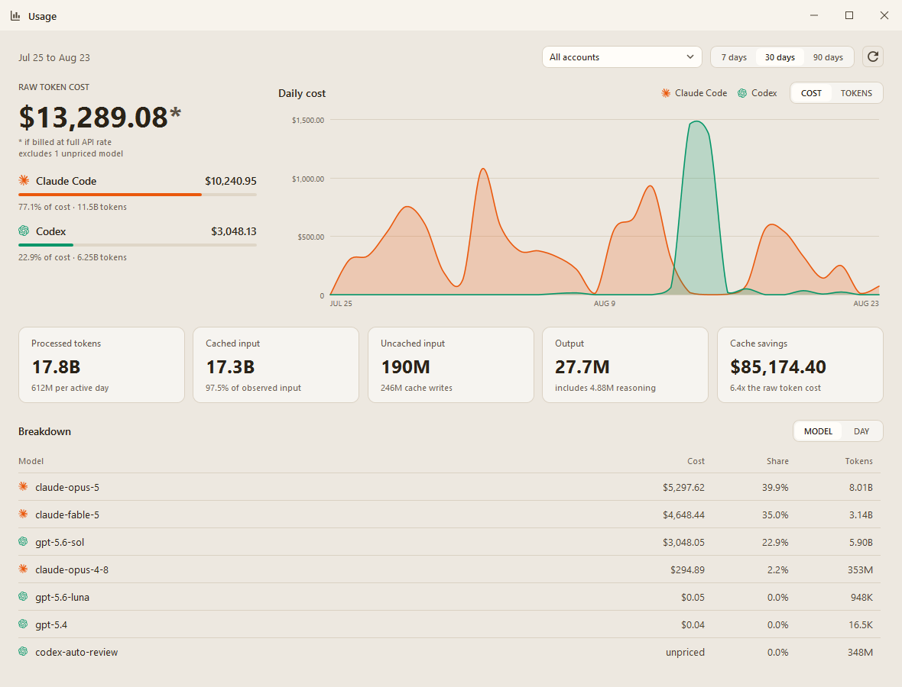

# AI Usage Tray 

A lightweight Windows tray app that shows, behind **one icon**, the live quota of several AI coding subscriptions:

- **Any number of Claude subscriptions** (5-hour and weekly windows), each via its own local OAuth profile
- **Any number of OpenAI / ChatGPT Codex accounts**, each with its own `CODEX_HOME`
- **Z.AI / GLM** coding plan (optional, API key)
- **GitHub Copilot** (optional, experimental, personal access token)

> **This is a fork of [fmdz387/costats](https://github.com/fmdz387/costats)** (MIT).
> It keeps costats' architecture and UI but changes what is monitored and how.
> See [What's different from upstream](#whats-different-from-upstream) and [Credits & license](#credits--license).

<p align="center">
  
  
</p>

<p align="center">
  
</p>
<p align="center"><sub>Usage dashboard: cost and tokens over the last 30 days, per provider, model or day.</sub></p>

## Features
- Tray icon shows the worst window's percentage as a number; Settings can display either used or remaining quota, with matching numbers and bars across desktop surfaces.
- **Four usage levels everywhere**, derived from the canonical used percentage: green when capacity is available, yellow and orange as quota runs down, and red near exhaustion. The same state is preserved when remaining quota is displayed.
- Percentages are shown as quiet tinted pills, so a calm account stays calm and a hot one stands out.
- Hovering the icon opens a popup next to it listing every account, one line each with a status dot.
- The widget (click the icon or `Ctrl+Alt+U`) opens on an overview of all accounts, sized to fit them; click a card for details.
- **Usage dashboard** (tray menu → **Usage stats**, or the chart button in the widget): token and cost analytics read from the local Claude Code and Codex logs, over the last 7, 30 or 90 days. Cost is priced at the published OpenAI and Anthropic API rates, so it answers "what would this have cost without a subscription". Filter by account, break the range down by model or by day, and see an account's cost in its detail view in the widget, with a link that opens the dashboard already filtered to it.
- **Codex reset credits**: when Codex reports a redeemable usage-limit reset, the widget shows it, along with when it expires.
- Model-scoped limits reported by Claude (e.g. the Fable weekly limit) shown per account.
- Plan chips for Claude (`Max 5x`, `Max 20x`, `Pro`...) and Codex (`Plus`, `Pro Lite`...).
- Optional primary account (star in Settings): drives the tray icon and is pinned to the top of the overview.
- **Warm stone light and blue steel dark themes**, following the Windows theme by default.
- Providers managed in Settings as a table with add/edit dialogs; changes apply without restarting.
- Optional reset countdowns on the overview cards; daily / 30-day cost estimates where the provider supplies them.
- Optional remote view: see your usage from a phone via a private link: one checkbox, no setup (self-hosting possible). Once it is on, a globe button in the widget opens the link straight away.
- Self-update from this repository's releases.

## Install / set up
**One-step PowerShell** (downloads the latest [release](https://github.com/ShlomiPorush/ai-usage-tray/releases/latest), installs per-user to `%LOCALAPPDATA%\AIUsageTray\app`, adds a Start Menu shortcut):
```powershell
iwr -useb https://raw.githubusercontent.com/ShlomiPorush/ai-usage-tray/main/scripts/install.ps1 | iex
```

**Manual:** download `ai-usage-tray-win-x64-vX.Y.Z.zip` (or `arm64`) from [Releases](https://github.com/ShlomiPorush/ai-usage-tray/releases), verify the `.sha256`, extract and run `AIUsageTray.exe`. Builds are self-contained (no .NET runtime needed) and not code-signed, so SmartScreen may warn.

**From source:** see **Build** below.

Then follow **[docs/WINDOWS-SETUP.md](docs/WINDOWS-SETUP.md)** for the step-by-step account setup:

1. Out of the box the app monitors the standard `~/.claude` (Claude Code login) and `~/.codex` (Codex CLI login) profiles. If you use both tools, it shows data immediately.
2. To monitor more accounts, open Settings → Accounts → **+ Add account**, pick the provider and fill in the fields it asks for: a display name and profile folder (with a folder picker) for Claude/Codex, an API key or token for Z.AI/Copilot. Sign in to extra accounts with the official CLI inside their folder (`CLAUDE_CONFIG_DIR=<dir> claude` / `CODEX_HOME=<dir> codex login`).
3. Changes apply immediately, no restart needed. Each row has **Edit**, **✕** (remove) and a star to mark the primary account.

## Configuration
Settings are stored at `%LOCALAPPDATA%\costats\settings.json` (path kept from upstream so existing installs keep working).

| Setting | Default | Meaning |
|---|---|---|
| `RefreshMinutes` | `5` | Background polling interval |
| `HotkeyEnabled` | `true` | Register the global widget shortcut |
| `Hotkey` | `Ctrl+Alt+U` | Toggle the widget |
| `AutomaticUpdateChecksEnabled` | `true` | Check GitHub for updates in the background |
| `StartAtLogin` | `false` | Registers `AiUsageTray` in the Run key |
| `Accounts[]` | one Claude (`~/.claude`) + one Codex (`~/.codex`) | Any mix of accounts: `Id`, `Type` (`claude`/`codex`), `DisplayName`, `ConfigDir`. Editable in Settings (add/remove). Legacy `OpenAiAccounts`/`ClaudeConfigDir` settings are migrated automatically. |
| Z.AI keys | empty | Coding-plan / pay-as-you-go keys. Set them in Settings → Accounts; they are stored in Windows Credential Manager, never in `settings.json`. |
| `CopilotEnabled` | `false` | Enable the Copilot provider |
| `Theme` | `system` | `system` / `light` / `dark` |
| `PrimaryAccountId` | empty | Provider id whose status drives the tray icon |
| `ShowOverviewResetTimes` | `false` | Reset countdowns on overview cards |
| `ShowRemainingPercentages` | `false` | Show remaining rather than used quota in desktop numbers and progress bars; colours preserve the same capacity warning state |
| `ShowFloatingStatusPanel` | `false` | Show the compact movable status panel with an X close button |
| `AutoStartClaudeFiveHourWindow` / `AutoStartCodexFiveHourWindow` / `AutoStartZaiFiveHourWindow` | `false` | Opt-in activation of the next observed five-hour window through the matching official CLI/profile. GLM requires its coding-plan key. |
| `RemoteViewEnabled` + `RemoteViewUploadUrl` / `RemoteViewPageUrl` | `false` / empty | Remote view (see below) |

`appsettings.json` (`Costats:Update`) controls updater infrastructure and release verification. Automatic checks can be switched off in Settings; manual checks remain available.

## Usage dashboard
Quota tells you how much of the subscription is gone; the usage dashboard tells you what you actually spent it on. Open it from the tray menu (**Usage stats**) or the chart button in the widget.

It reads the Claude Code and Codex session logs already on the machine (`~/.claude/projects`, `~/.codex/sessions` and any extra profile folders you configured), counts input, cached, cache-write and output tokens per model, and prices them at the published API list rates. The headline number is an estimated API value, not your subscription bill, and is normally far more than a subscription costs. Nothing is uploaded and no provider API is called: this is a local read of local files, cached incrementally so repeat opens are fast. Settings shows the current cache size and provides a clear-cache action; the next report after clearing performs a slower full scan.

Pick a range (7, 30 or 90 days), filter by account, and read the per-provider split, the chart and a breakdown table you can switch between model and day. Models the built-in table cannot price are counted in tokens and called out instead of being silently treated as free; you can price them yourself with `%LOCALAPPDATA%\costats\pricing.json`, a flat map of model id to USD per million tokens:

```json
{ "some-new-model": { "input": 0.2, "cachedInput": 0.02, "cacheWrite5m": 0.25, "output": 1.2 } }
```

## Remote view (phone / web)
Optional and off by default. Enable it in Settings → Remote view and press **Copy link**: that's the whole setup. After each refresh the app uploads a small snapshot (provider, account nickname, plan, usage percentages and reset times; never tokens or folder paths) to the built-in relay. A private write id authorises uploads, while the share link carries a one-way derived read id that cannot overwrite data. Anyone with the link can view the data. Entries expire server-side after 7 days without updates, so data from uninstalled apps cleans itself up. The built-in relay runs at [ai.yaaps.net](https://ai.yaaps.net), and the page can be installed as an app (PWA) straight from the browser.

Live demo: [https://ai.yaaps.net/?id=demo](https://ai.yaaps.net/?id=demo) (sample data, no account needed).

Self-hosting is optional: pull the published SQLite-backed container from GitHub Container Registry ([remote/server/README.md](remote/server/README.md), serves both page and API) or host the page separately ([web/README.md](web/README.md)), then override `RemoteViewUploadUrl` / `RemoteViewPageUrl` in `settings.json`. The previous Cloudflare Worker remains documented as a temporary rollback option.

## Data sources & privacy
- **OpenAI / Codex**: the official local `codex app-server` JSON-RPC method `account/rateLimits/read`, one short-lived process per account. The app never reads or copies account tokens; Codex owns authentication and refresh.
- **Claude**: Anthropic's OAuth usage endpoint using the isolated profile's token. This is not a documented public API and may change.
- **Z.AI**: `api.z.ai` usage endpoints with a Bearer token.
- **Copilot**: unofficial GitHub endpoint; token stored in Windows Credential Manager.
- No telemetry. Requests go only to the provider APIs above. Local credential files and the profile folders are git-ignored.

## What's different from upstream
Compared with `fmdz387/costats` v1.4.6 (the fork point):

| Area | costats (upstream) | AI Usage Tray (this fork) |
|---|---|---|
| OpenAI / Codex | One account, reads `~/.codex/auth.json` + OAuth endpoint, log-based estimates | **Any number of accounts** via `codex app-server`, separate `CODEX_HOME`s, account selector, editable in Settings |
| Claude | Claude Code usage from local logs; multiple profiles only through the external `multicc` tool | **Any number of Claude subscriptions** through per-account OAuth profiles (`ClaudeSubscriptionSource`), including model-scoped limits |
| Z.AI / GLM | not available | New provider (`ZaiUsageSource`) |
| UI | Fixed tabs per provider, static tray icon | Overview-first widget, dynamic tray icon (colour + used %), hover popup with per-account status dots, warm stone / blue steel themes, four-level usage colours, primary account |
| Usage analytics | Insights card CLI only | Built-in usage dashboard: tokens and API-rate cost from the local logs, per provider / account / model / day |
| Tests | none | `tests/costats.Core.Tests` (xunit) covering the new sources, parsers and tray composer |
| Settings | Fixed sections per provider | Providers table with add/edit dialogs; account changes apply live (`AccountSourceRegistry`) without a restart |
| Self-update | from `fmdz387/costats` | from this fork; updater/installer expect `AIUsageTray.exe` and `ai-usage-tray-win-*` assets |
| Branding | `costats.App.exe`, product "costats" | `AIUsageTray.exe`, product "AI Usage Tray", own version line |

## Build
Requires a .NET SDK that supports `net10.0-windows`. Version is centralised in `src/Directory.Build.props` (`VersionPrefix`).

```powershell
dotnet build .\costats.sln -c Release
dotnet test  .\costats.sln -c Release
.\scripts\publish.ps1          # portable single-file x64 + arm64 ZIPs with .sha256
```

## Insights Card CLI
`tools/insights-cli` is inherited unchanged from upstream (`npx costats ccinsights`, renders a Claude Code Insights card). See [tools/insights-cli/README.md](tools/insights-cli/README.md).

## Credits & license

- **Original project**: [costats](https://github.com/fmdz387/costats) by **fmdz**: base architecture, UI, updater, packaging and the insights CLI.
- **Multi-account foundation (v1.2.0)**: **[Yoav Yechiam](https://github.com/product-alliance)** / [Product Alliance](https://product-alliance.com): original multi-account OpenAI/Codex and Claude subscription monitor design that this fork extends.
- **Fork modifications** (multi-account Codex via app-server, Claude subscription source, Z.AI, dynamic tray icon, tests): **Shlomi Porush**.
- Licensed under the **MIT License**, see [LICENSE](LICENSE), which retains both upstream copyright notices.
- macOS/Linux alternative: [CodexBar](https://github.com/steipete/CodexBar).
